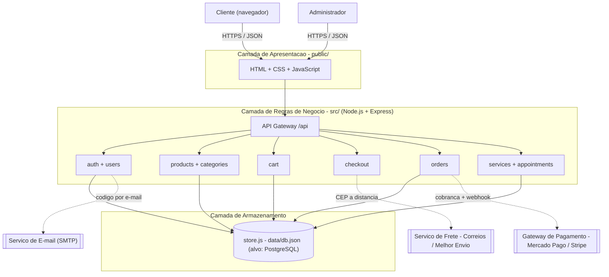
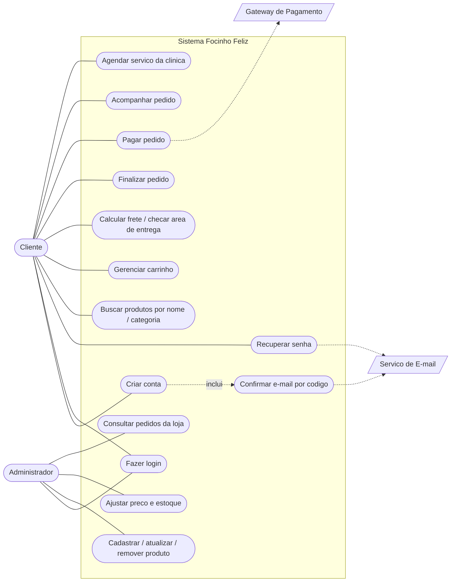
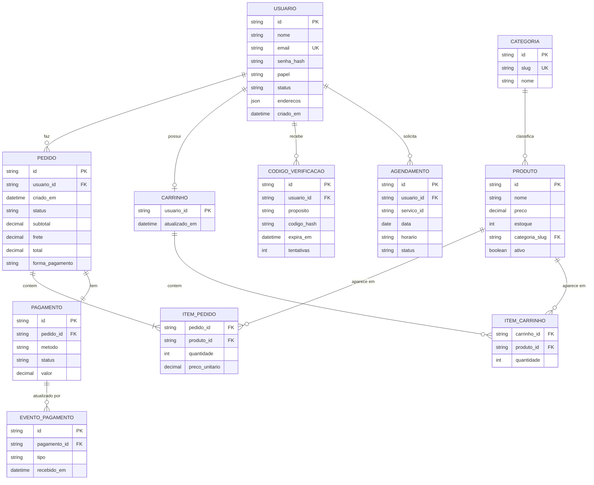
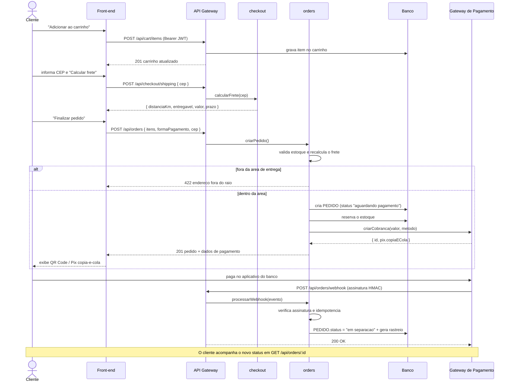

# Focinho Feliz — Documentação de Engenharia de Software

**Solução E-commerce para Pet Shop & Clínica**

| | |
|---|---|
| **Projeto** | Focinho Feliz — E-commerce v2 |
| **Contexto** | 1ª Solução — E-commerce (FATEC Taubaté) |
| **Repositório** | https://github.com/Endrigo413/focinho-feliz-petshop |
| **Versão do documento** | 1.0 — 08/09/2026 |
| **Stack implementada** | Node.js · Express · HTML/CSS/JS |

> Versão web deste documento (com os diagramas renderizados): publicada como Artifact do Claude.

---

## 1. Visão geral do sistema

O Focinho Feliz é uma loja virtual que vende produtos para animais de estimação e
permite agendar serviços da clínica veterinária (banho, tosa, consulta, hospedagem).

### Objetivo

Vender produtos pela internet com **segurança** (autenticação, confirmação de cadastro,
pagamento por gateway) e **rapidez** (catálogo com busca e filtros, carrinho persistente,
checkout em poucos passos), além de organizar a agenda de serviços da clínica.

### Público-alvo

- **Cliente final** — tutor de cães e gatos que compra ração, higiene, brinquedos e
  acessórios, e agenda banho, tosa ou consulta. Acessa pelo navegador, no celular ou no
  computador.
- **Administrador da loja** — funcionário responsável pelo catálogo: cadastra produtos,
  ajusta preços e estoque e acompanha os pedidos. Ao entrar, o site sinaliza que está em
  "modo administrador".

### Escopo principal

- **Catálogo de produtos** — listagem com busca por nome, filtro por categoria, espécie e
  faixa de preço, paginação e destaque de itens.
- **Carrinho de compras** — adicionar, alterar quantidade e remover itens, com verificação
  de estoque e cálculo de subtotal, frete e total.
- **Pagamentos** — geração de cobrança (Pix, cartão ou boleto) por um gateway externo e
  atualização automática do status do pedido via *webhook*.
- **Painel administrativo** — cadastro, atualização e remoção de produtos e preços,
  restritos ao perfil administrador.
- **Área de entrega** — centro de distribuição na FATEC Taubaté; o sistema calcula o frete
  por distância e recusa endereços fora do raio atendido.

### Glossário rápido

| Termo | Significado no sistema |
|---|---|
| **Pedido** | Compra fechada a partir do carrinho, com itens, valores, status e forma de pagamento. |
| **Cobrança** | Registro de pagamento criado no gateway (id, método, valor, status). O sistema não guarda dados de cartão. |
| **Webhook** | Chamada HTTP que o gateway de pagamento faz ao sistema para informar que uma cobrança foi paga, recusada ou estornada. |
| **Área de entrega** | Raio de 40 km em torno da FATEC Taubaté; fora dele o pedido não pode ser finalizado. |
| **Agendamento** | Reserva de um serviço da clínica para um pet, em data e horário, sujeita a confirmação. |

---

## 2. Requisitos de software

Requisitos funcionais descrevem *o que* o sistema faz; requisitos não funcionais
descrevem *como* ele se comporta.

### 2.1 Requisitos funcionais

| ID | Requisito | Prioridade | Onde no sistema |
|---|---|---|---|
| RF01 | O usuário cria uma conta e faz login. | Alta | `POST /api/auth/register`, `/login` |
| RF02 | O cadastro é confirmado por um código de 6 dígitos enviado por e-mail. | Alta | `POST /api/auth/verify-email`, `/resend-code` |
| RF03 | O usuário redefine a senha por código enviado por e-mail. | Média | `/forgot-password`, `/reset-password` |
| RF04 | O sistema permite buscar produtos por nome ou categoria (e filtrar por espécie e faixa de preço, com paginação). | Alta | `GET /api/products` |
| RF05 | O cliente adiciona, altera a quantidade e remove itens do carrinho, respeitando o estoque. | Alta | módulo `cart` (exige login) |
| RF06 | O cliente calcula o frete pelo CEP e o sistema informa se o endereço está na área de entrega. | Alta | `POST /api/checkout/shipping` |
| RF07 | O cliente finaliza a compra; o sistema gera o pedido, reserva o estoque e cria a cobrança. | Alta | `POST /api/orders` |
| RF08 | O pagamento é processado por um gateway (Pix, cartão ou boleto) e o status do pedido é atualizado automaticamente por webhook. | Alta | `POST /api/orders/webhook` |
| RF09 | O cliente acompanha seus pedidos: histórico, status e código de rastreio. | Média | `GET /api/orders`, `/api/orders/:id` |
| RF10 | O administrador cadastra, atualiza e remove produtos, preços e estoque. | Alta | `POST/PUT/DELETE /api/products` (perfil admin) |
| RF11 | O sistema identifica o administrador e sinaliza visualmente o "modo administrador". | Média | papel no JWT + barra no front-end |
| RF12 | O cliente agenda serviços da clínica (banho, tosa, consulta), sem permitir datas passadas. | Média | `POST /api/appointments` |

### 2.2 Requisitos não funcionais

| ID | Categoria | Requisito | Como o projeto atende |
|---|---|---|---|
| RNF01 | Desempenho | O site deve carregar em menos de 3 segundos. | Front-end estático sem framework nem etapa de build; assets locais; respostas de API pequenas. |
| RNF02 | Disponibilidade | O sistema deve ficar no ar 99,9% do tempo (≈ 43 min/mês de indisponibilidade). | Processo Node sem estado em memória crítico; `GET /api/health` para healthcheck; alvo de deploy com gerenciador de processos e réplicas. |
| RNF03 | Segurança — LGPD | Coletar o mínimo de dados pessoais e protegê-los. | Só nome, e-mail, telefone e endereço; senha nunca em texto puro; e-mail não é compartilhado com terceiros; dados isolados por conta. |
| RNF04 | Segurança — PCI-DSS | Dados de pagamento (cartão) criptografados e protegidos. | O sistema **não armazena dados de cartão**: a cobrança é criada no gateway (tokenização) e o sistema guarda apenas `id`, método e status. |
| RNF05 | Segurança — transporte | Comunicação e credenciais protegidas. | HTTPS em produção; senhas e códigos com `scrypt` + salt; JWT assinado (HS256); webhook autenticado por HMAC-SHA256 e idempotente. |
| RNF06 | Usabilidade | Interface acessível e utilizável em qualquer tela. | Layout responsivo; atributos ARIA; respeita `prefers-reduced-motion`; textos em português. |
| RNF07 | Manutenibilidade | Código organizado para evoluir com baixo custo. | Arquitetura em camadas + módulos por domínio; uma responsabilidade por arquivo. |
| RNF08 | Portabilidade | Trocar o banco de dados sem reescrever as regras de negócio. | Todo o acesso a dados passa por `src/db/store.js`. |
| RNF09 | Confiabilidade | Não perder pedidos nem vender além do estoque. | Estoque reservado ao criar o pedido; webhook idempotente; validação em cada serviço; persistência em arquivo entre reinícios. |

---

## 3. Arquitetura do sistema

Arquitetura em **três camadas** (apresentação, regras de negócio, armazenamento), com a
camada de negócio dividida em **módulos por domínio** atrás de um **API Gateway**. É um
monólito modular: roda como um processo só, mas cada domínio é isolado e poderia virar um
microsserviço.



### Frontend — interface do usuário

O que o cliente vê no navegador: vitrine, filtros, carrinho lateral, caixa de frete, modais
de login/cadastro e de checkout. Implementado em **HTML, CSS e JavaScript puro** (sem
framework nem build) para manter o carregamento rápido e a hospedagem simples.
*Equivalente de produção:* React, Vue.js ou Next.js consumindo a mesma API.

### Backend — regras de negócio

O "cérebro" do sistema: valida dados, autentica, calcula totais e frete, reserva estoque e
orquestra o pagamento. Implementado em **Node.js com Express**. Cada módulo tem as camadas
internas `rotas → controller → serviço → repositório`. O **API Gateway**
(`src/gateway/router.js`) é o ponto de entrada único e distribui as requisições para os
módulos.
*Equivalente de produção:* o mesmo Node.js/Express, ou Python (Django/FastAPI) ou Java (Spring Boot).

### Banco de dados

Onde ficam clientes, produtos e pedidos. Na versão atual, persistência em arquivo **JSON**
(`data/db.json`) através de `src/db/store.js`, suficiente para o MVP e mantendo o projeto
rodando com um único `npm start`.
*Equivalente de produção:* **PostgreSQL** ou MySQL — a migração afeta apenas `store.js`.

### Integrações externas

- **Gateway de pagamento** — cria a cobrança (Pix/cartão/boleto) e envia webhooks de status.
  Implementado como `payment.gateway.js` (simulado), com a mesma interface de Mercado Pago
  ou Stripe.
- **Serviço de frete** — cálculo por distância a partir da FATEC Taubaté (`geo.js`).
  Substituível por Correios ou Melhor Envio mantendo o contrato de `POST /api/checkout/shipping`.
- **Serviço de e-mail** — envia os códigos de confirmação. Transporte plugável: SMTP
  (nodemailer) ou, em desenvolvimento, arquivo em `data/emails/` + console.

> **Regra de negócio — área de entrega.** Centro de distribuição na **FATEC Taubaté**.
> Entregas em um raio de **40 km** (distância em linha reta até o centro do CEP).
> Frete = **R$ 0,59 por quilômetro**. Fora do raio, o pedido é recusado com `HTTP 422`.
> O servidor sempre recalcula o frete pelo CEP — nunca confia no valor enviado pelo cliente.

---

## 4. Modelagem de dados

Modelo relacional alvo (PostgreSQL). Na implementação atual, os itens do pedido e do
carrinho ficam embutidos no documento JSON; o DER abaixo os apresenta normalizados, como
seriam em um banco relacional.

### Usuário

| Campo | Tipo | Regras |
|---|---|---|
| `id` | texto | PK — `USR-...` |
| `nome` | texto | obrigatório, ≥ 2 caracteres |
| `email` | texto | obrigatório, único, formato de e-mail |
| `senha_hash` | texto | scrypt + salt; nunca a senha em texto puro |
| `papel` | enum | `cliente` \| `admin` |
| `status` | enum | `pendente` → `ativo` (após confirmar o e-mail) |
| `telefone` | texto | opcional |
| `enderecos` | lista | CEP, logradouro, número, bairro, cidade, UF |
| `criado_em` | data/hora | preenchido pelo sistema |

### Produto

| Campo | Tipo | Regras |
|---|---|---|
| `id` | texto | PK |
| `nome` | texto | obrigatório |
| `descricao` | texto | — |
| `preco` | decimal | ≥ 0, 2 casas |
| `estoque` | inteiro | ≥ 0 |
| `categoria` | texto | FK → Categoria (`slug`) |
| `especie` | texto | `cachorro` \| `gato` \| `todos` |
| `destaque` | booleano | aparece em evidência na vitrine |
| `ativo` | booleano | remoção lógica: `false` some do catálogo mas preserva o histórico |

### Pedido

| Campo | Tipo | Regras |
|---|---|---|
| `id` | texto | PK — `PED-...` |
| `usuario_id` | texto | FK → Usuário (nulo em pedido de visitante) |
| `criado_em` | data/hora | data do pedido |
| `status` | enum | `aguardando pagamento` → `em separação` → `enviado` → `entregue` (ou `pagamento recusado` / `reembolsado`) |
| `subtotal` | decimal | soma dos itens |
| `frete` | decimal | recalculado pelo CEP no servidor |
| `total` | decimal | `subtotal + frete` |
| `forma_pagamento` | enum | `pix` \| `cartao` \| `boleto` |
| `endereco_entrega` | texto/objeto | capturado no checkout |

### Item do Pedido

| Campo | Tipo | Regras |
|---|---|---|
| `pedido_id` | texto | FK → Pedido |
| `produto_id` | texto | FK → Produto |
| `quantidade` | inteiro | ≥ 1, ≤ estoque no momento da compra |
| `preco_unitario` | decimal | **congelado no momento da compra** (não muda se o preço do produto mudar depois) |

### Entidades de apoio

| Entidade | Para quê | Campos principais |
|---|---|---|
| **Categoria** | Classifica os produtos e alimenta os filtros. | `id`, `slug` (único), `nome` |
| **Carrinho** / **Item do Carrinho** | Um carrinho por usuário; guarda produto + quantidade. | `usuario_id` (PK), `atualizado_em`; item: `produto_id`, `quantidade` |
| **Pagamento** | Cobrança criada no gateway; 1:1 com o pedido. | `id`, `pedido_id`, `metodo`, `status`, `valor` |
| **Evento de Pagamento** | Idempotência dos webhooks. | `id`, `pagamento_id`, `tipo`, `recebido_em` |
| **Código de Verificação** | Confirmação de e-mail e redefinição de senha. | `id`, `usuario_id`, `proposito`, `codigo_hash`, `expira_em`, `tentativas` |
| **Agendamento** | Reserva de um serviço da clínica para um pet. | `id`, `usuario_id`, `servico_id`, `data`, `horario`, `status` |

---

## 5. Diagramas essenciais

### 5.1 Diagrama de casos de uso



O administrador herda as ações do cliente.

### 5.2 Diagrama de entidade-relacionamento (DER)



**PK** chave primária · **FK** chave estrangeira · **UK** única.

### 5.3 Diagrama de sequência — compra

Passo a passo desde o clique em "Adicionar ao carrinho" até a aprovação do pagamento pelo gateway.



---

## 6. Decisões e evolução

### Principais decisões de projeto

| Decisão | Motivo |
|---|---|
| Persistência em arquivo JSON | MVP didático que roda com um único `npm start`; a camada `store.js` isola a troca por PostgreSQL. |
| JWT e hash sem bibliotecas externas | Só o módulo `crypto` do Node. Em produção: `jsonwebtoken` e `bcrypt`. |
| Confirmação de e-mail obrigatória | Reduz contas falsas; código com validade, limite de tentativas e reenvio controlado. |
| Gateway de pagamento simulado | Mesma interface de um provedor real, permitindo trocar por Mercado Pago/Stripe sem mexer nos `orders`. |
| Remoção lógica de produtos | Preserva a integridade do histórico de pedidos. |
| Frete recalculado no servidor | Segurança: o cliente não define o frete nem burla a área de entrega. |

### Caminho para produção

- **Frontend:** reimplementar a interface em React/Next.js consumindo a mesma API.
- **Banco:** PostgreSQL com migrações; normalizar itens de pedido/carrinho em tabelas.
- **Pagamento:** SDK do Mercado Pago ou Stripe no lugar do gateway simulado.
- **Frete:** integrar Correios ou Melhor Envio, mantendo a checagem de raio como regra própria.
- **Infra:** HTTPS, contêineres, réplicas, *rate limiting*, *refresh tokens*, observabilidade e backups.

### Como executar

```bash
npm install
npm start        # http://localhost:3000  (cria o banco inicial e uma conta admin)
```

Detalhes de arquitetura em [`docs/ARQUITETURA.md`](ARQUITETURA.md).
